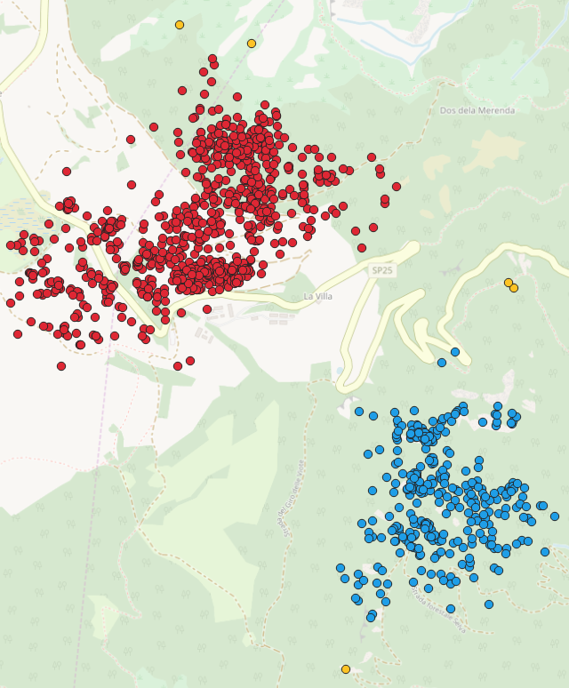

# PostGIS-on-Python-3-and-DBSCAN-implementation

In this project, we use the dataset "animale" which contains a trajectory 
of 1189 points taken from a roe deer. The positions are expressed in projected 
coordinates (EPSG 3857). We have to implement DBSCAN algorithm in order to find 
the most densely populated areas from the animal.

